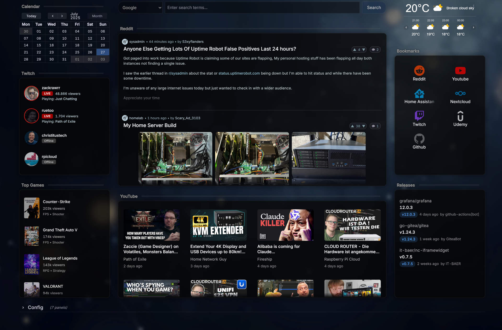

# Grafana Dashboards

<div align="center">

[](https://www.gnu.org/licenses/agpl-3.0)
[](https://grafana.com/)


**This Repository contains a Collection of Grafana Dashboards.
<br>
Each Dashboard is organized in its own directory with all necessary Assets and Documentation.**
</div>

## 📊 Dashboards

### [Glancy](dashboards/glancy/)
A Fancy Dashboard at a Glance for aggregating content from multiple sources including Reddit, Twitch, YouTube, and GitHub.
**For detailed installation and configuration Instructions, please see the [dashboard-specific README](dashboards/glancy/README.md).**



<br>

### [Unbound DNS](dashboards/unbound-dns/)
Dashboard for Monitoring Unbound DNS via OPNsense API, including all necessary Assets. 
**For detailed installation and configuration Instructions, please see the [dashboard-specific README](dashboards/unbound-dns/README.md).**


<br>

## ⚙️ Installation

### 📋 Prerequisites

- Grafana (v11.0.0 or higher)
- Plugins required by specific dashboards (see individual dashboard documentation)
- Data sources configured as required by specific dashboards

### 🔽 Import via Grafana UI

1. Clone this repository:

```bash
git clone https://github.com/IT-BAER/grafana.git
```

2. Navigate to the directory of the dashboard you want to import (e.g., `dashboards/unbound-dns/`)
3. In Grafana, navigate to **Dashboards** → **+ Import**
4. Click on **Upload JSON file** and select the `dashboard.json` file from the dashboard's directory
5. Before finalizing the import, ensure the dashboard is using your working data sources
6. (OPTIONAL) Copy any Assets from the Dashboard's `assets` folder to your Grafana's public assets directory (Usually ```/usr/share/grafana/public/img/bg```)

> **ℹ️ Note:** The path may vary depending on your Grafana installation. Refer to individual dashboard documentation for specific asset requirements.

<br>

## 🚨 Troubleshooting

If images are not displaying properly for any dashboard:

1. Verify that the assets were copied to the correct location
2. Check Browser Dev Tools for any path-related errors
3. Ensure the image paths in the dashboard JSON match where you placed the assets
4. Refer to the specific dashboard's documentation for additional troubleshooting steps

<br>

## 💜 Support Development

If you find any of these Dashboards useful, consider supporting this and future creations, which heavily relies on Coffee:

<div align="center">
<a href="https://www.buymeacoffee.com/itbaer" target="_blank"></a>
</div>

<br>

## 📄 License

This project is licensed under the [AGPL-3.0](LICENSE) license.
